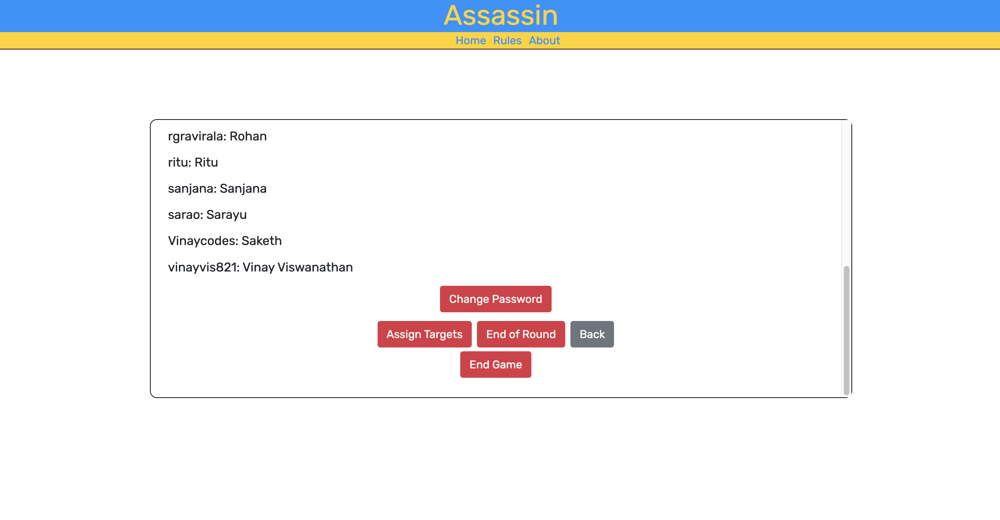
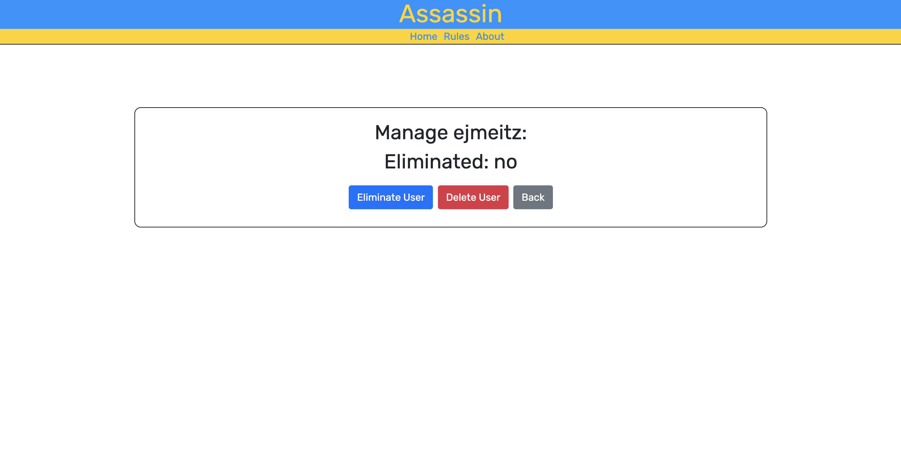
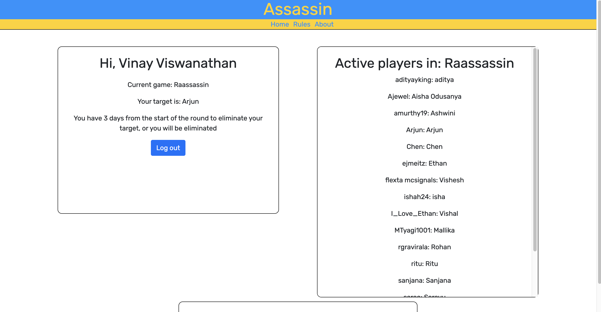
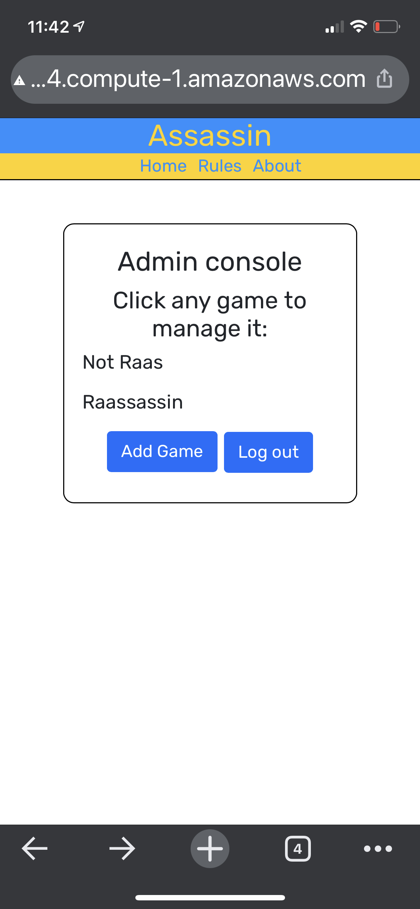

# Assassin

Using this [website](http://ec2-54-86-95-204.compute-1.amazonaws.com/~ejmeitz/assassin/index.php), users can host and manage their own assassin games. An admin can create new games with a password for users to join. Once all users are in a game, an admin can start the game by randomnly assigning all players a target.

As players get eliminated during gameplay, the admin can eliminate them in the application and the player's assassin will automatically be assigned their target's target. After the round ends, the admin can press a button to eliminate all players who have not eliminated their target yet. Then the admin can randomly assign targets for the next round.

The game ends when there is one person left standing.

This was designed to host a game for my Raas club inaugural Assassin game.

### Technologies used

- The LAMP stack was employed (along with HTML, CSS, and Javascript for front end)

## Future plans:

- ~~Add passwords for users (password hash)~~
- ~~Add active player board~~
- ~~Cross off elimated players in admin console (add real name)~~
- Add adjustable round lengths
- Add 'forgot password' and 'reset password' functionality to player accounts
- Better and more styling to work better with mobile (flex box)
- More thorough testing with cleaner code

## Images:

Below are some images of the website running on a laptop and mobile. See the images folder (in resources) to see more images of the website

### Admin Console

Below are pictures of the admin console (managing the game and managing each induvidual player in the game)

### User Console

Below is a picture of the what a regular user in the game sees.

### Mobile

Below is a image of the game running on a mobile device.

